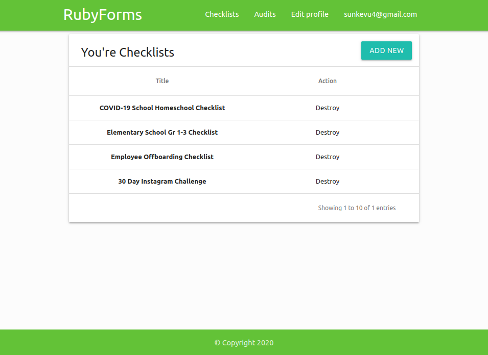

<h1 align="center"> RubyForms </h1> <br>
<p align="center">
  <a href="https://github.com/Synkevych/ProjID-HR014/">
    
  </a>
</p>
<br/>

<br/>
<p align="center">
  RubyForms easy form creation and answers to them. Built with RoR framework.
</p>

<!-- START doctoc generated TOC please keep comment here to allow auto update -->
<!-- DON'T EDIT THIS SECTION, INSTEAD RE-RUN doctoc TO UPDATE -->
## Table of Contents

- [Introduction](#introduction)
- [Features](#features)
- [Getting started](#getting-started)
- [Feedback](#feedback)

<!-- END doctoc generated TOC please keep comment here to allow auto update -->

## Introduction

Create new form with dinamic question field, view you checklist. Register to this app using devise gem.

## Features

A few of the things you can do with RubyForms:

* Register to app or login 
* Create new checklist form with unlimited questions
* If your survey form is ready, publish it
* Find the required survey among the published survey forms and create forms with answers
* Answer all questions in the survey and save your result

## Getting started

##### Prerequisites

The setups steps expect following tools installed on the system.

- Github
- Ruby [2.6.3](https://www.ruby-lang.org/en/news/2019/04/17/ruby-2-6-3-released/)
- Rails [5.2.4.3](https://weblog.rubyonrails.org/2020/5/18/Rails-5-2-4-3-and-6-0-3-1-have-been-released/)
- PostgreSQL >= 9.3

##### 1. Check out the repository

```bash
git clone https://github.com/Synkevych/ProjID-HR014.git
```

##### 2. Create database.yml file

Copy the sample database.yml file and edit the database configuration as required.

```bash
cp config/database.yml.sample config/database.yml
```

##### 3. Create and setup the database

Run the following commands to create and setup the database.

```ruby
rails db:create
rails db:setup
rails db:migrate
```

##### 4. Start the Rails server

You can start the rails server using the command given below.

```ruby
rails s
```

And now you can visit the site with the URL http://localhost:3000

##### 5. Running specs tests

You can run all tests using the command given below.

```bash
# Default: Run all spec files (i.e., those matching spec/**/*_spec.rb)
$ rspec

# Run all spec files in a single directory (recursively)
$ rspec spec/models

# Run a single spec file
$ rspec spec/controllers/accounts_controller_spec.rb

# Run a single example from a spec file (by line number)
$ rspec spec/controllers/accounts_controller_spec.rb:8

# See all options for running specs
$ rspec --help
```

## Feedback

Feel free to send us feedback on [Twitter](https://twitter.com/synkevych) or [file an issue](https://github.com/Synkevych/ProjID-HR014/issues/new). Feature requests are always welcome.
